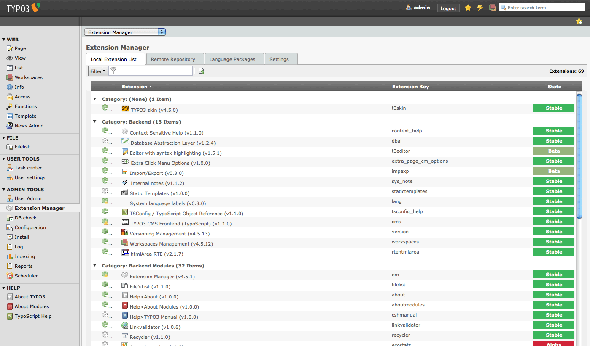

:navigation-title: Administrator manual

..  include:: /Includes.rst.txt

..  _admin-manual:

====================
Administrator manual
====================

Target group: **Administrators / Integrators**

This manual describes how to install and configure Jobfair2: activating the
extension, including its Site Sets, and setting the storage folder and page
IDs the extension needs.

..  _admin-manual-installation:

Installation
============

#.  Require the extension via Composer:

    ..  code-block:: bash

        composer require jweiland/jobfair2

#.  Activate the extension, either via the :guilabel:`Extensions` module in
    the TYPO3 backend, or via the command line:

    ..  code-block:: bash

        vendor/bin/typo3 extension:setup

#.  Open the :guilabel:`Site Configuration` module for the site the jobs
    should appear on, and add the Site Set :guilabel:`Jobfair 2 - Main`
    (`jweiland/jobfair2`). It automatically pulls in `jweiland/maps2-default`,
    `jweiland/maps2-googlemaps` and `jweiland/jobfair2-pdf`.

#.  Create a storage folder page for job, job area and job type records, and
    configure it below.

    The :guilabel:`Extensions` module, where Jobfair2 can be activated.

..  _admin-manual-settings:

Site settings
=============

The following settings are available once the Site Set has been added to a
site and can be adjusted per site under :guilabel:`Site Configuration >
Settings`:

..  typo3:site-set-settings:: PROJECT:/Configuration/Sets/Jobfair/settings.definitions.yaml
    :name: jobfair2-site-settings

..  _admin-manual-import:

Importing jobs automatically
============================

Jobfair2 does not ship with a preconfigured job source. To pull job postings
from an external API on a schedule, implement one small PHP class and
register a TYPO3 :guilabel:`Scheduler` task that runs the console command
described in :ref:`admin-api`. That page walks through building such a
class step by step.

..  toctree::
    :maxdepth: 2
    :titlesonly:
    :hidden:

    Api/Index
