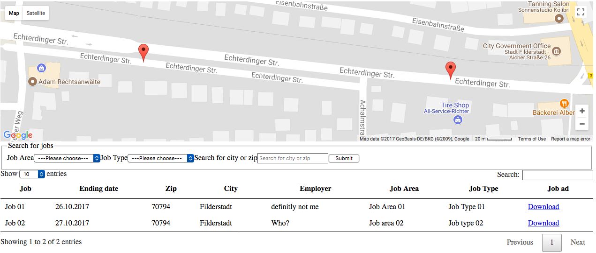

:navigation-title: Introduction

..  include:: /Includes.rst.txt

..  _introduction:

================
What does it do?
================

Jobfair2 gives website visitors an overview of currently open job positions -
whether they belong to your own company or to one of your partners. Job
locations are displayed on a map using :ext:`maps2`, and the list itself is
rendered as a sortable, searchable table powered by DataTables.

Visitors can narrow down the list with the search form: by job area, by job
type, and by ZIP code or city. The ZIP code/city field offers autocomplete
suggestions based on existing addresses. Job areas and job types are managed
as simple backend records, described in more detail in the
:ref:`Users manual <users-manual>`.

Every column of the table can be sorted and filtered individually, just like
in any other DataTables-powered list. Each job can additionally be exported
as a PDF document, e.g. for printing or for an application by post.

    Frontend output of Jobfair2: a searchable, sortable list of open job
    positions.
