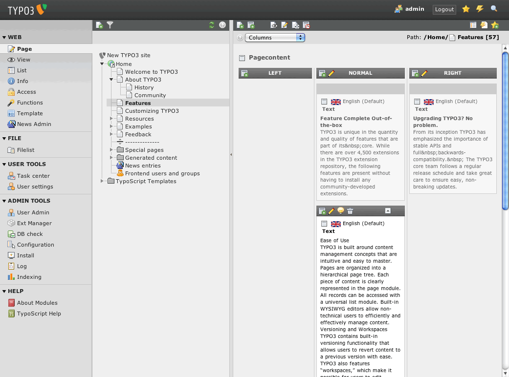

:navigation-title: Users manual

..  include:: /Includes.rst.txt

..  _users-manual:

============
Users manual
============

Target group: **Editors**

This manual describes how to maintain job areas, job types and job postings
in the TYPO3 backend, and how to configure the "Job board" content element on
a page.

    The Page module, where job records are listed and edited.

..  _users-manual-job-areas-and-types:

Job areas and job types
=======================

Job areas (e.g. "IT", "Skilled trade", "Administration") and job types (e.g.
"Full-time", "Part-time", "Apprenticeship") are simple records with only a
:guilabel:`Title` field. Create them directly in the storage folder
configured by the administrator, the same way you would create any other
record: open the folder in the :guilabel:`Page` module, switch to list view,
and use :guilabel:`Create new record`.

Both are used later on to categorize job postings and to populate the
corresponding search filters on the frontend.

..  _users-manual-creating-a-job:

Creating a job
==============

A job posting is created as a record of its own type in the storage folder.
The most relevant fields are:

:guilabel:`Job` / :guilabel:`Reference number`
    The job title as shown on the frontend, and an internal reference
    number (e.g. an internal vacancy number).

:guilabel:`Description`
    A rich-text description of the vacancy.

:guilabel:`Address`
    The job location. This is a relation to an address record
    (:ext:`tt_address`) and is also used to place the marker on the map.

:guilabel:`Job area` / :guilabel:`Job type`
    Assigns the job to one of the records described in
    :ref:`users-manual-job-areas-and-types`. Used for the frontend search
    filters.

:guilabel:`Application deadline` / :guilabel:`Start date`
    The period during which the job is shown on the frontend. Jobs whose
    deadline is in the past are automatically excluded from the list.

:guilabel:`Employer` / :guilabel:`Employer address`
    Free-text employer name, plus an optional, separate address if it
    differs from the job location above.

:guilabel:`Job ad`
    An optional PDF upload of the original job advertisement.

:guilabel:`Internal`
    Marks the job as for-internal-use only. As of this version, this is
    only reflected in the backend preview of the content element - it does
    not yet hide the job from the frontend list automatically.

..  note::
    Jobs can also be created automatically by a scheduled import. Such jobs
    are marked with a different record icon and most of their fields become
    read-only. See the :ref:`Administrator manual <admin-manual>` for
    details.

..  _users-manual-content-element:

The "Job board" content element
===============================

Add the content element via :guilabel:`Content > Create new content element
> Job board`. It offers the following options:

:guilabel:`Max entries to show (0 for all)`
    Limits how many jobs are listed at once. Use :guilabel:`0` to show all
    matching jobs.

:guilabel:`Show Search`
    Shows or hides the search form (job area, job type, ZIP code/city) above
    the job list.

:guilabel:`Job areas`
    Restricts the content element to one or more job areas. Leave empty to
    show jobs from all areas.

:guilabel:`Is Internal?`
    See the note on the :guilabel:`Internal` field above.

Clicking on a job in the list opens its detail view on the same page.
